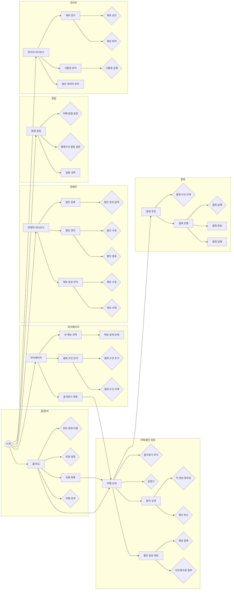

# 캐치 커피 — 유저 플로우

> 원본 기획 문서(2026-06-12) 기반.

```mermaid
flowchart LR

  subgraph s1 ["홈/탐색"]
    n1(("시작"))
    n2["홈/지도"]
    n3{"위치 권한 허용"}
    n4{"반경 설정"}
    n5["카페 목록"]
    n6{"카페 검색"}
  end

  subgraph s2 ["카페/할인 정보"]
    n7["카페 상세"]
    n8{"즐겨찾기 추가"}
    n9{"길찾기"}
    n10["할인 상세"]
    n11{"이 정보 맞아요"}
    n12{"확인 취소"}
    n13["할인 정보 제보"]
    n14{"제보 등록"}
    n15{"사진/영수증 첨부"}
  end

  subgraph s3 ["결제"]
    n16["결제 추천"]
    n17{"결제 수단 선택"}
    n18["결제 진행"]
    n19{"결제 실행"}
    n20["결제 완료"]
    n21["결제 실패"]
  end

  subgraph s4 ["마이페이지"]
    n22["마이페이지"]
    n23["내 제보 내역"]
    n24["제보 상태 상세"]
    n25["즐겨찾기 목록"]
    n26["결제 수단 관리"]
    n27{"결제 수단 추가"}
    n28{"결제 수단 삭제"}
  end

  subgraph s5 ["알림"]
    n29["알림 설정"]
    n30{"카페 알림 설정"}
    n31{"결제수단 알림 설정"}
    n32["알림 내역"]
  end

  subgraph s6 ["판매자"]
    n33["판매자 대시보드"]
    n34["할인 등록"]
    n35{"할인 정보 입력"}
    n36["할인 관리"]
    n37{"할인 수정"}
    n38{"할인 종료"}
    n39["제보 정보 관리"]
    n40{"제보 수정"}
    n41{"제보 삭제"}
  end

  subgraph s7 ["관리자"]
    n42["관리자 대시보드"]
    n43["제보 검수"]
    n44{"제보 승인"}
    n45{"제보 반려"}
    n46["크롤링 관리"]
    n47{"크롤링 실행"}
    n48["할인 데이터 관리"]
  end

  n1 --> n2
  n2 --> n3
  n2 --> n4
  n2 --> n5
  n2 --> n6
  n5 --> n7
  n2 --> n7
  n7 --> n8
  n7 --> n9
  n7 --> n10
  n7 --> n13
  n7 --> n16
  n10 --> n11
  n10 --> n12
  n13 --> n14
  n13 --> n15
  n16 --> n17
  n16 --> n18
  n18 --> n19
  n18 --> n20
  n18 --> n21
  n1 --> n22
  n22 --> n23
  n23 --> n24
  n22 --> n25
  n22 --> n26
  n26 --> n27
  n26 --> n28
  n1 --> n29
  n29 --> n30
  n29 --> n31
  n29 --> n32
  n1 --> n33
  n33 --> n34
  n34 --> n35
  n33 --> n36
  n36 --> n37
  n36 --> n38
  n33 --> n39
  n39 --> n40
  n39 --> n41
  n1 --> n42
  n42 --> n43
  n43 --> n44
  n43 --> n45
  n42 --> n46
  n46 --> n47
  n42 --> n48
  n25 --> n7
```
